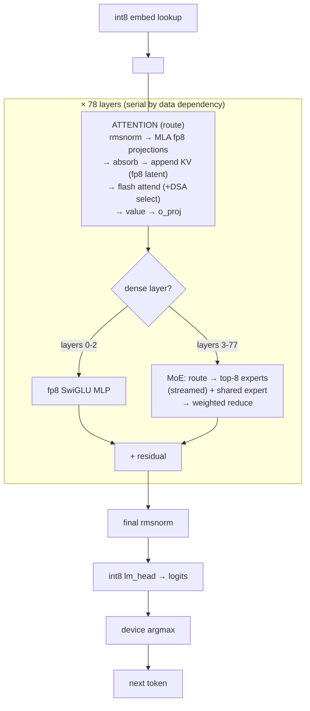
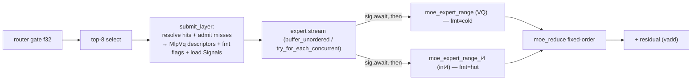

# rivoli — architecture

A single-node decode engine for the GLM-5.2 MoE model (78 layers, 256 routed experts,
top-8, hidden 6144) on the **AMD Strix Halo** APU (gfx1151, 40 CUs, unified LPDDR5 at
256 GB/s). The model's routed experts are far too large to keep resident, so rivoli is
built around one idea:

> **Stream the cold experts from NVMe and hide the fetch behind compute.** Weights that
> fit stay device-resident; weights that don't are streamed on demand and overlapped so
> the GPU rarely waits on the disk.

Everything below — the io_uring fetcher, the async-signal bridge, the byte-arena cache,
the descriptor-array MoE launch — exists to make that overlap real and correct. The design
target is *correct overlap*: the fast path must never race the slow path, and Rust's
ownership model is used deliberately to make the dangerous interleavings unrepresentable.

---

## 1. The two memory regions

The APU has no separate VRAM — host LPDDR5 *is* GPU memory via GTT. rivoli splits the
device budget into two regions, each a single VMM allocation made once at startup
(sole-tenant; the amdgpu large-GTT wedge bug forbids mid-session re-allocation):

```
 device budget (≈115 GiB of 116 GiB GTT)
┌──────────────────────────────────────────────────────────────────────────┐
│  RESIDENT TIER (DeviceTier / VmmBuf, bump-allocated once, ~16 GiB)          │
│    per layer:  fp8 attn projections + block scales                         │
│                fp8 dense-MLP (first 3 layers)                              │
│                f32 norms, f32 router gate                                  │
│                int3-vq / int4 shared expert                               │
│                (optional) fp8/bf16 DSA indexer                            │
│    global:     int8 embed, int8 lm_head, f32 final norm, 3 fp16 codebooks  │
├──────────────────────────────────────────────────────────────────────────┤
│  ROUTED POOL (ArenaPool over a second VmmBuf, the rest ≈ 99 GiB)           │
│    a cache of streamed routed experts — never all resident at once         │
│    two-ended byte arena: COLD (int3-vq) from the low end,                  │
│                          HOT (int4) from the high end, split floats        │
└──────────────────────────────────────────────────────────────────────────┘
```

- **Resident tier** (`src/device.rs`, `src/pin.rs`): everything that fits and is touched
  every token. Filled in place at startup (`pread`/memcpy into host-mapped VMM — no
  separate H2D), then handed to kernels as raw device pointers. Bump-allocated: filled
  once, freed as a unit, so there is no free list.
- **Routed pool** (`src/arena.rs`, `src/hybrid.rs`, `src/pin.rs`): a fixed-size cache. The
  working set (≈19k distinct experts) dwarfs it (~6900 slots), so it evicts. This is where
  streaming and caching happen.

The routed experts are the whole reason the engine is interesting: they are the bandwidth
driver, and hiding their fetch is the central problem.

---

## 2. The decode pipeline (one token)



Per token the residual stream passes through 78 layers **serially** (layer L+1 needs L's
output). Within a layer: **attention** (the `route` phase) then **MoE** (the `moe` phase,
or a dense fp8 MLP for the first 3 layers), each added back to the residual. After the last
layer: final norm → `lm_head` → device argmax (only 8 bytes come back to the host per
token).

The serial dependency is real and unavoidable, so rivoli does **not** parallelize across
layers. The concurrency it exploits is *inside* the MoE phase: fetching cold experts while
computing the resident/already-loaded ones.

---

## 3. Fetch parallelism — the io_uring streamer

`src/stream.rs` + `kernels/async.hip`. A routed-expert miss is a random NVMe read of one
O_DIRECT-aligned block (a whole `gate‖up‖down` expert). A single read is latency-bound
(~4 GB/s); the array delivers ~5.8–6.7 GB/s at queue depth ≥ 4, and **~11 GB/s at the
deeper queues a real MoE layer produces** (measured 2026-07-30 in-engine: 2.25 GB/token
over a 206 ms fetch window = 10.9 GB/s aggregate, 12.4 GB/s marginal per added miss). So
the fetcher's job is to **keep the queue full**:

- **Submit-all, join-once.** A MoE layer submits *all* its cold reads to the ring at once,
  so they hit the NVMe concurrently, and joins once — not read-by-read.
- **SQPOLL poller thread.** The ring runs its own submission-queue poller. Without it,
  `submit` is an `io_uring_enter` where the *calling* thread walks the SQEs and drives
  blk-mq inline, serially, at QD1 (2.53 GB/s). The poller takes the whole SQ tail at once →
  genuinely concurrent (6.69 GB/s). Falls back to a plain ring (still correct, QD1) if
  SQPOLL is refused.
- **Two destination modes.** BOUNCE (default): read into a pinned host arena, then
  `hipMemcpyAsync` into the VMM slot. DIRECT (`--direct-vmm-dma`): DMA straight into VMM.
  Bounce is the default because DMA into VMM device pages is *write*-slow — 5.66 GB/s vs
  12.4 GB/s into the pinned arena — so DIRECT more than doubles the cost of a miss. It also
  sidesteps an amdgpu kernel bug that EFAULTs on O_DIRECT DMA into VMM pages.
  **Ablated 2026-07-30** (int3-vq/dense/lru @512): marginal cost per missed expert 1239 µs
  (bounce) → 2709 µs (DIRECT); 386 → 837 ms/tok; 2.59 → 1.19 tok/s. The read side is
  untouched — the flag only flips the streamer's `bounce` destination and never changes pool
  allocation, so kernels read the same device-local VMM in both modes (zero-miss layer
  1563 vs 1525 µs). An earlier version of this bullet credited a ~40% MoE-dot read tax from
  host-mapped VMM; the flag does not produce that configuration.
- The module owns all the **O_DIRECT alignment math** (block-aligned offset, length, and
  buffer) so the rest of the engine deals in logical `(fd, begin, len)` read-specs.

The payoff: fetch overlaps compute rather than serializing behind it — reads for a layer's
misses go to the device concurrently and each expert's kernel launches as its own bytes
land, so a miss costs ~1239 µs against a ~2700 µs serialized read.

**But the engine is DISK-bound, not compute-bound** — the reverse of what this section
claimed until 2026-07-30. At 75.6% hit rate a token fetches 146.65 experts × 15.34 MB =
**2.25 GB**, which even at the ~12 GB/s marginal rate is **~181 ms of transfer** against
only **117 ms of compute** (a zero-miss layer is 1563 µs × 75 MoE layers; `moe_bench.rs`
independently floors the kernels at 113 ms). You cannot hide 181 ms behind 117 ms.

The retracted "~95% hidden" came from `1 − (moe_wall − compute_gpu)/fetch_wall`, where
`compute_gpu` is a **bracket** (a HipEvent span over the whole MoE phase) that *contains*
the stalls it is being used to rule out. Every millisecond blocked on a missing expert was
counted as compute, hence as fetch successfully hidden. The true ceiling is
`compute/fetch_wall` = 117/206 = **≤57%**. The arithmetic settles it: at 95% hidden the MoE
phase should be ~125 ms against a measured `moe_wall` of 266 ms, a 141 ms hole; under the
stall reading 117 + 149 = 266 closes exactly.

Consequence for the roadmap: perfect overlap floors at `max(117, 181) + ~102 route ≈ 283
ms/tok` (**~3.5 tok/s** vs 2.59 today). Past that, only moving *fewer bytes* helps — hit
rate or a smaller expert format — not better timing.

---

## 4. The async-signal bridge — the keystone

`src/gpustream.rs`. The mechanism that lets the fetcher and the compute stream interleave
without the host blocking on `hipDeviceSynchronize`:

> A GPU-stream op (or an io_uring completion's bounce-copy) becomes a **future** that
> resolves when the hardware reaches that point. A `hipLaunchHostFunc` callback fires a
> `Waker`; `futures-util` then orchestrates GPU + NVMe concurrency directly.

```mermaid
sequenceDiagram
  participant Loop as decode loop (1 runtime, single thread)
  participant Reaper as reaper thread (io_uring + fetch HipStream)
  participant NVMe
  participant Comp as compute HipStream (GPU)

  Loop->>Reaper: submit_layer → batch of cold reads
  Reaper->>NVMe: submit all (SQPOLL, concurrent)
  par per expert e
    NVMe-->>Reaper: read e lands
    Reaper->>Comp: bounce→slot copy on fetch stream, arm Signal(e)
    Note over Loop: sig[e].await resolves when the COPY lands
    Loop->>Comp: launch_moe_expert_range(e) on compute stream
  end
  Loop->>Comp: moe_reduce, then stream_signal().await
  Comp-->>Loop: layer done → residual add
```

- **One runtime, single-threaded, borrows `&mut self`.** `generate()` drives the whole
  decode from **one** `block_on`; `forward()` is `async` and awaits the expert stream
  inline (no per-layer `block_on`). The runtime is local (not on `self`) so the future can
  borrow `&mut self` — the engine's state is single-owner throughout.
- **The reaper is the only other thread** (`src/asyncfetch.rs`). It owns the demand ring
  and a dedicated fetch stream (`backend::Stream::fetch()` — a `hipStream_t` under `rocm`, a
  third `VkQueue` with its own ring and timeline under `vulkan`); it queues+submits the batch,
  reaps completions one-by-one, and arms each read's `Signal` on the fetch stream *after*
  kicking its bounce→slot copy — so `load(e)` resolves when the **copy** lands, not merely
  the NVMe read. A cache **hit** never enters here; its load is `Signal::ready()`.
- The `StreamExt` pipeline stays single-threaded on the decode loop; the reaper blocks
  off-thread; the two meet **only** through `Signal` wakers. That is the entire concurrency
  surface — deliberately small.

---

## 5. MoE compute — the descriptor-array launch

`src/gpu.rs`, `kernels/moe.hip`. For each MoE layer, top-8 routed experts + 1 shared expert
are computed and combined. The launch is where fetch and compute overlap:



- **One descriptor for both formats.** `ExpertDesc` is six device pointers
  (gate/up/down × weights+scales). The VQ and int4 kernels *reinterpret* the same struct at
  their own slot offsets — a per-expert `fmt` bool (from the expert's tier) picks
  `launch_moe_expert_range` (VQ gather) vs `_i4` (nibble decode).
- **Per-expert launch gated by its Signal.** Each expert's partial launches on the compute
  stream only once its load `Signal` resolves — a resident/loaded expert launches
  immediately; a miss's launch waits on its fetch. `try_for_each_concurrent(ndesc, …)`
  drives them all: the misses fetch while the resident experts compute. The bubbles between
  host-gated launches are the residual cost the cache-routing proposals attack.
- **Fixed-order reduce.** Partials are independent rows; `moe_reduce` sums them in a fixed
  order (deterministic output regardless of completion order). The shared expert folds in
  as a resident 9th descriptor (weight 1.0, always `ready()`).
- **Two decode formats.** int3-vq: a 12-bit codebook index per subvector + bf16 group
  scale; the dot is an L1 codebook gather (latency-bound, the smallest/most-resident).
  int4: nibbles + one f32 scale per `I4_GROUP` (128) input columns, applied inside the
  dot (sequential decode, ~1.8× faster compute, bigger).
  The `--mode` picks which format the routed experts use; `hybrid` runs hot experts int4
  and cold experts vq3 in the one arena.

---

## 6. Caching & residency — the byte-arena pool

`src/arena.rs`, `src/hybrid.rs`, `src/pin.rs`. The routed pool is a cache keyed by
`(layer, expert)`; a hit reuses the resident slot, a miss evicts and streams.

**Two-ended byte arena** (`arena.rs`): COLD (int3-vq, 15.3 MB) slots pack from the low end,
HOT (int4, 20.1 MB) from the high end, tightly, with a floating gap in the middle:

```
 low ────────────────────────────────────────────────────────── high
 [cold0][cold1]…[coldN] →        ← gap →        ← [hotM]…[hot1][hot0]
        COLD frontier grows up          HOT frontier grows down
```

Because the slot sizes differ, growing one tier past the gap requires **compacting** the
other: relocate its boundary slot into a freed hole so the frontier can retreat. The arena
is *pure `usize` geometry* — it emits `Reloc{from,to}` events; the pin executes each as a
synchronous device memcpy of the expert bytes and remaps the key. This split (integer model
here, device effect in the pin) is deliberate: the dangerous pointer work is derived from a
model that is **fully host-tested** with no GPU.

**Byte-aware policies** (`hybrid.rs`): `lru | 2q | arc`, each operating on bytes (not slot
counts) and reporting a `Tier` (Cold/Hot) per admission so the pool knows which slab a
missed expert lands in. `Tier` is the *minimal* interface between policy and pool — the
policy's internal segments (2Q's A1in/Am, ARC's T1/T2) never leak.

**The per-batch invariant that keeps it correct.** `submit_layer` runs three phases per MoE
layer:

1. `begin_batch()` — clear the policy's per-batch pin set.
2. For each **hit**: `get()` + `protect()` (pins the key for this batch).
3. For each **miss**: `admit()` (evict + place + compact, pins the admitted key too), then
   resolve every expert's final slot and build the reads.

The invariant: **a miss's eviction must never reclaim a key touched earlier in the same
batch.** Eviction (`pop_lru_skip`) skips the pinned set, so a hit or an earlier-admitted
miss can't be evicted out from under the batch — otherwise the pin could not resolve its
slot ("expert not resident after alloc"). Misses are allocated *before* any read is issued,
so a relocation never races an in-flight fetch. This is the correctness spine of the cache;
it is enforced structurally and covered by a batch-protocol stress test.

---

## 7. Attention — the route phase

`src/gpu.rs`, `kernels/mla.hip`, `kernels/attn.hip`, `kernels/linalg.hip`. GLM's MLA
(multi-head latent attention), everything fp8 where the source allows:

- **Projections** are fp8-e4m3 GEMVs with 128-block scales (`gemv_fp8`; long-reduction
  shapes like `o_proj` dispatch to a split-K variant). Norms are f32 (`rmsnorm`), the
  router gate is f32.
- **KV cache** is a device-resident **fp8-e4m3 latent** slab + f32 block-scale slab + bf16
  roped-key slab, grown by `append_kv` (one token per step). Storing the compressed latent
  (not full K/V) is what makes long context affordable.
- **Flash attend** over the fp8 latent (`launch_attend`), with an optional `rows` gather
  when the DSA sparse indexer is active. `mla_absorb`/`mla_value` bracket the attend.
- **DSA indexer (optional).** A small extra attention (`indexer.hip`) that scores past
  tokens and selects a sparse top-k the main attend restricts to, engaged past the 2048
  `index_topk`. The selection is a **device top-k kernel** (a per-block binned scan,
  `TOPK_BLOCK`/`TOPK_BINS`) — it replaced a host score-D2H + CPU top-k, cutting −9.4 ms/tok
  with a bit-identical selection (so the whole DSA path now stays on device, no per-layer
  round-trip). Present only if the artifact carries indexer weights (`--attn auto` detects
  them). See `docs/NPU.md` for the measured offload analysis.

Route is context-independent at short context (the projections dominate) and grows with
context (the attend scan). It has been through an ISA-driven tuning pass (`docs/PERF.md`).

---

## 8. How Rust provides guarantees around the critical invariants

The hard part of this engine is not any single kernel — it is the *interleaving*: a fetch
thread, a compute stream, a host loop, and a cache all mutating shared device memory
concurrently. rivoli leans on Rust's type system so the unsafe interleavings are
**unrepresentable**, not merely "avoided by discipline."

- **Single-owner engine, borrow-checked futures.** The decode future borrows `&mut self`,
  and the runtime is local rather than stored on `self`. The borrow checker therefore
  guarantees no *other* code touches the engine while a token is in flight — the async
  concurrency is over GPU streams and the reaper, never over aliased `&mut` state. A design
  that tried to share the engine across tasks simply would not compile.
- **The fetch↔compute boundary is one type.** All cross-thread communication is a `Signal`
  (a waker + a resolved flag). The reaper thread and the decode loop share nothing else;
  there is no lock protecting engine state because there is no shared engine state. `Send`/
  `Sync` are implemented narrowly and only where the hardware contract actually holds (the
  over-broad `unsafe Sync` on the HIP stream was removed precisely because it claimed more
  than was true).
- **The cache invariant is enforced, not documented.** "Never evict a key touched this
  batch" is not a comment — it is `pop_lru_skip(&pinned)`, and `submit_layer` returns
  `Result`, so a slot that can't be resolved is a typed error, not a silent OOB. The
  arena's pointer arithmetic is derived from a `usize`-only model with its own host tests,
  so the device memcpy targets are correct *by construction of a proven integer model*.
- **`unsafe` is quarantined.** Every raw-pointer / FFI operation is behind a `rivoli_*` C
  wrapper or a `SAFETY:`-commented block that names the invariant it relies on (slot within
  the VMM, sync retired the writer, distinct non-overlapping slots). Descriptor structs
  crossing the FFI are `#[repr(C)]` POD `Copy` types, so "serialize to bytes" is a
  transmute the compiler validates, not a hand-rolled layout.
- **No silent failure on the hot path.** `clippy` runs with `unwrap_used` and `expect_used`
  **denied**, so every fallible step propagates a `Result`; the forward pass carries a
  finiteness bail (a NaN in the logits aborts rather than emits garbage) and a watchdog
  thread aborts the process if a token never lands. Errors surface as data, not as a hung
  GPU.
- **Ownership pins the lifetimes that back device pointers.** The resident `Safetensors`
  mmap is borrowed only while the tier is filled and dropped after; the `.vq3`/`.i4` fd
  owners (`ExpertSet`) live as long as the pool that streams through them. A raw device
  pointer never outlives the allocation it points into because the allocation's owner
  outlives it in the type graph.

> **CORRECTED 2026-07-30.** This paragraph used to claim: *"the ONLY way to get overlap
> wrong (a read into a slot that later moves, **a compute launch before its bytes land**, a
> hit evicted mid-batch) is ruled out at compile time or by a typed runtime invariant."*
>
> The middle clause was false, and a speculative-prefetch bug proved it: readiness is
> carried as `hit: Vec<bool>`, and `gpu.rs` launches every `hit` expert WITHOUT awaiting its
> signal ("a hit's Signal is already resolved, so awaiting it buys nothing"). Marking a slot
> whose bytes were still in flight as a hit therefore skipped the wait entirely, and the
> kernel read unwritten memory. Nothing ruled it out, because "should I wait?" was a bool
> crossing a module boundary.
>
> Two of the three hazards listed ARE structurally enforced (`pop_lru_skip(&pinned)`;
> allocate-before-read). The third was enforced by nothing. A claim of this kind is worse
> than no claim: it tells a reader a check is unnecessary.

## 8b. Invariants (INV-n) — and the mechanism that keeps this section honest

Every invariant below is numbered and has a test named `inv_<n>_*`. The rule is mechanical:
**a documented invariant with no test, or a test naming an invariant no longer documented,
is a defect.** That exists because prose drifted from behaviour repeatedly — §8's claim
above stayed on the page for months after it stopped being true, and two metrics
(`compute_gpu_ns`, `fetch_n`) reported ratios whose numerator and denominator came from
different populations. Numbering converts "the doc drifted" into something a check can see.

| ID | invariant | test |
|---|---|---|
| **INV-1** | Routing is a pure function of (gate logits, bias, top_k) — it never consults the cache, so any cache change is output-bit-identical by construction | `math.rs::inv_1_routing_never_consults_the_cache` |
| **INV-2** | A LOOKA hint never promotes, admits, or leaves residue in policy state; it may only delay an eviction | `hybrid.rs::inv_2_hints_leave_no_residue_in_policy_state` |
| **INV-3** | A hint can never fail an allocation — vetoes are advisory and are dropped rather than starve eviction | `hybrid.rs::inv_3_hints_can_never_starve_eviction` |
| **INV-4** | A device-side wait may be enqueued BEFORE its producer exists and still waits (the property `hipStreamWaitEvent` lacks) | `gpustream.rs::inv_4_wait_enqueued_before_signal_still_waits` |

INV-4 is the foundation of the ticketed dataflow that replaces the `hit` mask: it is what
lets consumers be recorded up front, behind waits on values nothing has signalled yet.

---

## 9. Weight formats

| weights | format | resident? | why |
|---|---|---|---|
| routed experts | **int3-vq** (12-bit idx + bf16 g64 scale) and/or **int4** (nibble + f32 g128 scale) | streamed | the bandwidth driver; `--mode` picks the format |
| shared expert | int3-vq / int4 | resident | folded into the MoE launch |
| attention projections | **fp8** e4m3 + 128-block scale | resident | native source precision |
| dense-layer MLPs (first 3) | **fp8** | resident | consistent with attention |
| embed / lm_head | **int8** + per-row scale | resident | unchanged |
| norms, router gate | **f32** | resident | tiny |
| DSA indexer (wk/wq_b fp8; weights_proj/k_norm bf16→f32) | fp8 / f32 | resident (optional) | present iff the artifact carries it |

Codebooks are **per-projection** (gate/up/down), learned once, resident (~192 KiB), stored
fp16 (L1-resident so the MoE gather is cheap).

## 10. On-disk artifact — one self-contained directory

```
<model>/
  manifest.json          # format version, full ModelConfig, VQ params, offsets
  codebooks.f32          # 3 × VQ_K × VQ_DIM (gate, up, down)
  resident.safetensors   # every resident weight (attn/dense fp8, norms/gate f32,
                         #   int8 embed/lm_head, final norm) — filled into the tier
  L{03..NN}.vq3          # one int3-vq file per MoE layer (aligned expert blocks)
  L{03..NN}.i4           # optional int4 twin per MoE layer (--mode int4|hybrid)
  indexer.safetensors    # optional DSA indexer weights (enables --attn dsa)
  tokenizer.json, generation_config.json
```

`.vq3`/`.i4` blocks are `gate‖up‖down` at O_DIRECT-aligned stride (VQ_ALIGN = 4096); index
`n_experts` is the shared expert. Headers are validated on open; a dim/version mismatch
fails loud. `convert` produces the vq3 artifact; `fp8_to_i4` derives the `.i4` twins
directly from the fp8 source (`vq3_to_i4`, the retired lossy chain, is DELETED — see
docs/INT4.md; artifacts it produced are still identifiable by their `i4_source` stamp);
`add_indexer` writes the side indexer file (see `benchmarks.md` for int4 provenance).

## 11. Module map

- `format` — the artifact reader (manifest + `resident.safetensors` + `.vq3`/`.i4`
  mmap/index); single source of the on-disk layout.
- `device` — `DeviceTier`/`VmmBuf` (the resident bump slab).
- `stream` — io_uring O_DIRECT streamer; `asyncfetch` — the reaper + per-expert `Signal`;
  `gpustream` — the HIP-completion→future bridge.
- `arena` — two-ended byte arena; `hybrid` — byte-aware cache policies; `cache` —
  `OrderedSet`/`Tier`/`TwoQSplit` substrate.
- `pin` — resident placement + the routed-expert `ArenaPool` (`submit_layer` protocol).
- `gpu` — the async forward pass; `hip` — the HIP/rocm FFI surface; `quant`/`math`/`model`
  — leaf.
- `attn`/`indexer` — attention modes + DSA. `telemetry` — the always-on PROFILE summary.
- `backend` — the build-time backend waist (`rocm` XOR `vulkan`, one impl chosen at compile
  time, no vtable). It IS the seam now: `gpu`, `pin`, `asyncfetch` and `stream` import it
  rather than `hip`. `vk`/`vkstream` — the **Vulkan compute backend**
  (`--features vulkan`): 16 of 29 kernels, and it DECODES `--mode int3-vq --attn dense` over
  three queues with the fetch↔compute overlap intact (97% hidden, against ROCm's 96%). Still
  ~1.9x slower end to end, all of it MoE kernel throughput; see `docs/VULKAN.md`.
- `kernels/*.hip` — moe, mla, attn, linalg, indexer, fwd, async, vmm (HIP/rocm).
  `kernels/vk/*.comp` → SPIR-V via the `build.rs` vulkan arm (the second backend).
- `src/bin/` — `convert`, `fp8_to_i4`, `add_indexer`, `i4_audit`, `ppl`, `replay`. (There
  is no `pack_i4` and no longer a `vq3_to_i4`; docs that reference either are stale.)

See `docs/PERF.md` for the performance roadmap, `MODES.md` for the format/policy matrix, and
`benchmarks.md` for measured throughput and quality.
