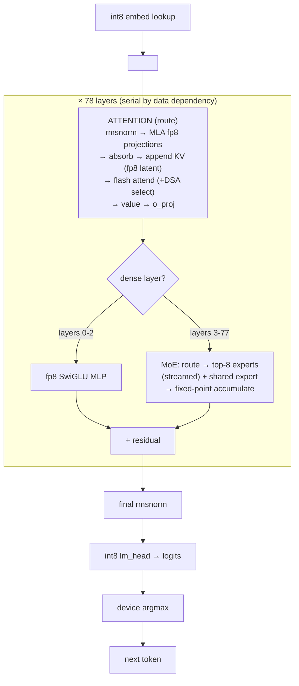
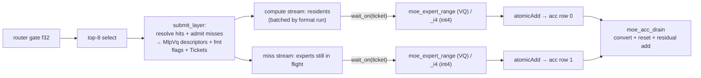

# rivoli — architecture

A single-node decode engine for the GLM-5.2 MoE model (78 layers, 256 routed experts,
top-8, hidden 6144) on the **AMD Strix Halo** APU (gfx1151, 40 CUs, unified LPDDR5 at
256 GB/s). The model's routed experts are far too large to keep resident, so rivoli is
built around one idea:

> **Stream the cold experts from NVMe and hide the fetch behind compute.** Weights that
> fit stay device-resident; weights that don't are streamed on demand and overlapped so
> the GPU rarely waits on the disk.

Everything below — the io_uring fetcher, the async-signal bridge, the byte-arena cache,
the descriptor-array MoE launch — exists to make that overlap real and correct. The design
target is *correct overlap*: the fast path must never race the slow path, and Rust's
ownership model is used deliberately to make the dangerous interleavings unrepresentable.

---

## 1. The two memory regions

The APU has no separate VRAM — host LPDDR5 *is* GPU memory via GTT. rivoli splits the
device budget into two regions, each a single VMM allocation made once at startup
(sole-tenant; the amdgpu large-GTT wedge bug forbids mid-session re-allocation):

```
 device budget (≈115 GiB of 116 GiB GTT)
┌──────────────────────────────────────────────────────────────────────────┐
│  RESIDENT TIER (DeviceTier / VmmBuf, bump-allocated once, ~16 GiB)          │
│    per layer:  fp8 attn projections + block scales                         │
│                fp8 dense-MLP (first 3 layers)                              │
│                f32 norms, f32 router gate                                  │
│                int3-vq / int4 shared expert                               │
│                (optional) fp8/bf16 DSA indexer                            │
│    global:     int8 embed, int8 lm_head, f32 final norm, 3 fp16 codebooks  │
├──────────────────────────────────────────────────────────────────────────┤
│  ROUTED POOL (ArenaPool over a second VmmBuf, the rest ≈ 99 GiB)           │
│    a cache of streamed routed experts — never all resident at once         │
│    two-ended byte arena: COLD (int3-vq) from the low end,                  │
│                          HOT (int4) from the high end, split floats        │
└──────────────────────────────────────────────────────────────────────────┘
```

- **Resident tier** (`src/device.rs`, `src/pin.rs`): everything that fits and is touched
  every token. Filled in place at startup (`pread`/memcpy into host-mapped VMM — no
  separate H2D), then handed to kernels as raw device pointers. Bump-allocated: filled
  once, freed as a unit, so there is no free list.
- **Routed pool** (`src/arena.rs`, `src/hybrid.rs`, `src/pin.rs`): a fixed-size cache. The
  working set (≈19k distinct experts) dwarfs it (~6900 slots), so it evicts. This is where
  streaming and caching happen.

The routed experts are the whole reason the engine is interesting: they are the bandwidth
driver, and hiding their fetch is the central problem.

---

## 2. The decode pipeline (one token)



Per token the residual stream passes through 78 layers **serially** (layer L+1 needs L's
output). Within a layer: **attention** (the `route` phase) then **MoE** (the `moe` phase,
or a dense fp8 MLP for the first 3 layers), each added back to the residual. After the last
layer: final norm → `lm_head` → device argmax (only 8 bytes come back to the host per
token).

The serial dependency is real and unavoidable, so rivoli does **not** parallelize across
layers. The concurrency it exploits is *inside* the MoE phase: fetching cold experts while
computing the resident/already-loaded ones — and, since 2026-07-31, **across two token rows
within one pass** when speculative decode is on (§13). The diagram above describes one row;
a verify pass runs the same graph with `R = 2` rows threaded through every kernel.

---

## 3. Fetch parallelism — the io_uring streamer

`src/stream.rs` + `kernels/async.hip`. A routed-expert miss is a random NVMe read of one
O_DIRECT-aligned block (a whole `gate‖up‖down` expert). A single read is latency-bound
(~4 GB/s); the array delivers ~5.8–6.7 GB/s at queue depth ≥ 4, and **~11 GB/s at the
deeper queues a real MoE layer produces** (measured 2026-07-30 in-engine: 2.25 GB/token
over a 206 ms fetch window = 10.9 GB/s aggregate, 12.4 GB/s marginal per added miss). So
the fetcher's job is to **keep the queue full**:

- **Submit-all, join-once.** A MoE layer submits *all* its cold reads to the ring at once,
  so they hit the NVMe concurrently, and joins once — not read-by-read.
- **SQPOLL poller thread.** The ring runs its own submission-queue poller. Without it,
  `submit` is an `io_uring_enter` where the *calling* thread walks the SQEs and drives
  blk-mq inline, serially, at QD1 (2.53 GB/s). The poller takes the whole SQ tail at once →
  genuinely concurrent (6.69 GB/s). Falls back to a plain ring (still correct, QD1) if
  SQPOLL is refused.
- **Two destination modes.** BOUNCE (default): read into a pinned host arena, then
  `hipMemcpyAsync` into the VMM slot. DIRECT (`--direct-vmm-dma`): DMA straight into VMM.
  Bounce is the default because DMA into VMM device pages is *write*-slow — 5.66 GB/s vs
  12.4 GB/s into the pinned arena — so DIRECT more than doubles the cost of a miss. It also
  sidesteps an amdgpu kernel bug that EFAULTs on O_DIRECT DMA into VMM pages.
  **Ablated 2026-07-30** (int3-vq/dense/lru @512): marginal cost per missed expert 1239 µs
  (bounce) → 2709 µs (DIRECT); 386 → 837 ms/tok; 2.59 → 1.19 tok/s. The read side is
  untouched — the flag only flips the streamer's `bounce` destination and never changes pool
  allocation, so kernels read the same device-local VMM in both modes (zero-miss layer
  1563 vs 1525 µs). An earlier version of this bullet credited a ~40% MoE-dot read tax from
  host-mapped VMM; the flag does not produce that configuration.
- The module owns all the **O_DIRECT alignment math** (block-aligned offset, length, and
  buffer) so the rest of the engine deals in logical `(fd, begin, len)` read-specs.

The payoff: fetch overlaps compute rather than serializing behind it — reads for a layer's
misses go to the device concurrently and each expert's kernel launches as its own bytes
land, so a miss costs ~1239 µs against a ~2700 µs serialized read.

**But the engine is DISK-bound, not compute-bound** — the reverse of what this section
claimed until 2026-07-30. At 75.6% hit rate a token fetches 146.65 experts × 15.34 MB =
**2.25 GB**, which even at the ~12 GB/s marginal rate is **~181 ms of transfer** against
only **117 ms of compute** (a zero-miss layer is 1563 µs × 75 MoE layers; `moe_bench.rs`
independently floors the kernels at 113 ms). You cannot hide 181 ms behind 117 ms.

The retracted "~95% hidden" came from `1 − (moe_wall − compute_gpu)/fetch_wall`, where
`compute_gpu` is a **bracket** (a HipEvent span over the whole MoE phase) that *contains*
the stalls it is being used to rule out. Every millisecond blocked on a missing expert was
counted as compute, hence as fetch successfully hidden. The true ceiling is
`compute/fetch_wall` = 117/206 = **≤57%**. The arithmetic settles it: at 95% hidden the MoE
phase should be ~125 ms against a measured `moe_wall` of 266 ms, a 141 ms hole; under the
stall reading 117 + 149 = 266 closes exactly.

**The code kept printing the retracted number until 2026-08-01.** This section had the
diagnosis for two days while `PROFILE/tok` still said "97% hidden" every run, because the
retraction was written here and not into `Profile::summary`. The tell was there for anyone
who ran the arm: `--direct-vmm-dma` printed **99% hidden** while decoding at 1.11 tok/s
against bounce's 2.26. `exposed` is now `moe_wall` minus a **measured** counterfactual —
`moe_ns_by_miss[0]`, the mean bracket of the layers that missed nothing, times the layer
count — which puts the same two arms at 22% and 10%. A metric whose ordering disagrees with
throughput is not reporting a small error; it is reporting nothing.

Consequence for the roadmap: perfect overlap floors at `max(117, 181) + ~102 route ≈ 283
ms/tok` (**~3.5 tok/s** vs 2.59 today). Past that, only moving *fewer bytes* helps — hit
rate or a smaller expert format — not better timing.

### What the drive actually does, and why the fetch cannot go faster (2026-08-01)

Measured with `docs/measurement/probes/fetch_batch.hip`, which reproduces the engine's exact shape —
`hipHostMalloc` bounce buffers, submit-*m*-drain-all-*m* batches, random 15.3 MB reads
across the 75 layer files, and a GPU kept busy streaming LPDDR5 beside it:

| queue depth | 1 | 2 | 4 | 8 |
|---|---|---|---|---|
| GB/s, GPU busy | **7.7** | 12.1 | 13.0 | 10.9 |
| GB/s, GPU idle | 8.8 | 12.6 | 13.3 | 13.7 |

A decode achieves **~10 GB/s**. Weighting the table by the engine's own per-layer miss
distribution (`moe_us_by_miss`: 18% of layers miss once, 23% twice, 20% three times) predicts
15.8 s against a measured `io_wait` of 18.3 s over 64 tokens — inside the probe's own
run-to-run spread. **The demand fetch is already getting what its queue depth can buy.**

Three things this rules out, each of which looked plausible first:

- *The bounce copy is the serial tail.* It is 0.18 ms per expert at 87 GB/s
  (`fetch_stream_ops.hip`) against a ~1.3 ms read. Not the bottleneck.
- *The pinned arena costs read bandwidth.* Pinned and pageable are within noise at every
  queue depth.
- *Splitting a read raises the queue depth for free.* It does — one expert split two ways
  goes 1.94 → 1.44 ms — but only the 18% of layers that miss exactly once benefit, so it is
  ~2% overall against a real change to the ring. Measured and dropped.

What is left is the **duty cycle**. The ring only has work between a layer's routing and its
MoE launch, so the drive is idle ~35% of every token (18.3 s of NVMe in a 28.3 s decode).
Nothing inside the fetch path can fix that: a read cannot be issued before the router names
the expert, and the router cannot run before that layer's attention. Filling it means
predicting the routing one layer ahead — which is speculation, and is the one lever left.
The ticket gate (§8b, INV-4/INV-6) is what makes such a read safe to issue; `docs/investigations/cross-layer-prefetch.md`
records what the last attempt at predicting cost and bought.

---

## 4. The async-signal bridge — the keystone

`src/gpustream.rs`. The mechanism that lets the fetcher and the compute stream interleave
without the host blocking on `hipDeviceSynchronize`:

> A GPU-stream op becomes a **future** that resolves when the hardware reaches that point.
> A `hipLaunchHostFunc` callback fires a `Waker`; `futures-util` then orchestrates GPU
> concurrency directly.

**An io_uring completion's bounce-copy used to be one of those futures. It is not any more,
and the bridge is smaller for it.** The ticketed dataflow (INV-5) moved each expert's
dependency onto the device, so nothing awaited the per-read `Signal` — `gpu.rs` took the
`Vec<Signal>` and dropped it — while `asyncfetch` went on arming one `hipLaunchHostFunc` per
miss on the fetch stream, a host round trip recorded INTO the queue whose copies it delayed.
Deleted 2026-08-01. What is left is one arm per stream per layer, which the decode loop
genuinely awaits.

The deletion also exposed that the reaper's failure path had been releasing the vestigial
half: it resolved those signals and never touched the timelines, so a fetch error hung the
device on a `hipStreamWaitValue64` nothing would ever satisfy. See INV-6 in §8b.

```mermaid
sequenceDiagram
  participant Loop as decode loop (1 runtime, single thread)
  participant Reaper as reaper thread (io_uring + fetch stream)
  participant NVMe
  participant Comp as compute stream (residents)
  participant Miss as miss stream (in-flight experts)

  Loop->>Reaper: submit_layer → batch of cold reads, one Ticket each
  Reaper->>NVMe: submit all (SQPOLL, concurrent)
  Loop->>Comp: residents: wait_on(RESIDENT) + moe_expert_range → atomicAdd acc row 0
  Loop->>Miss: misses: wait_on(ticket) + moe_expert_range → atomicAdd acc row 1
  Note over Loop,Miss: BOTH enqueued up front — no host round trip, and no join between them
  par per expert e still in flight
    NVMe-->>Reaper: read e lands
    Reaper->>Miss: bounce→slot copy on fetch stream, signal timeline[e]
    Note over Miss: the wait enqueued for e is satisfied; its kernel runs
  end
  Note over Loop,Miss: host awaits BOTH streams — the only sync, and it already existed
  Loop->>Comp: moe_acc_drain — converts, resets, and IS the residual add
```

- **One runtime, single-threaded, borrows `&mut self`.** `generate()` drives the whole
  decode from **one** `block_on`; `forward()` is `async` and awaits the expert stream
  inline (no per-layer `block_on`). The runtime is local (not on `self`) so the future can
  borrow `&mut self` — the engine's state is single-owner throughout.
- **The reaper is the only other thread** (`src/asyncfetch.rs`). It owns the demand ring
  and a dedicated fetch stream (`backend::Stream::fetch()` — a `hipStream_t` under `rocm`, a
  third `VkQueue` with its own ring and timeline under `vulkan`); it queues+submits the batch,
  reaps completions one-by-one, and arms each read's `Signal` on the fetch stream *after*
  kicking its bounce→slot copy — so `load(e)` resolves when the **copy** lands, not merely
  the NVMe read. A cache **hit** never enters here; its load is `Signal::ready()`.
- The `StreamExt` pipeline stays single-threaded on the decode loop; the reaper blocks
  off-thread; the two meet **only** through `Signal` wakers. That is the entire concurrency
  surface — deliberately small.

---

## 5. MoE compute — the descriptor-array launch

`src/gpu.rs`, `kernels/moe.hip`. For each MoE layer, top-8 routed experts + 1 shared expert
are computed and combined. The launch is where fetch and compute overlap:



- **One descriptor for both formats.** `ExpertDesc` is six device pointers
  (gate/up/down × weights+scales). The VQ and int4 kernels *reinterpret* the same struct at
  their own slot offsets — a per-expert `fmt` bool (from the expert's tier) picks
  `launch_moe_expert_range` (VQ gather) vs `_i4` (nibble decode).
- **Per-expert launch gated by a device-side wait (INV-5).** Every descriptor carries a
  `Ticket` — the timeline value its data lands at — and the launch loop enqueues
  `wait_on(ticket)` before each dispatch. Resident experts carry `Ticket::RESIDENT`
  (value 0, satisfied on arrival), so resident / missing / in-flight are ONE path with no
  residency branch and **no host round trip**: the whole layer is enqueued at once and the
  GPU gates itself.

  This replaced a `hit: Vec<bool>` that told the loop whether to await. That mask was a
  second host-side encoding of "is this data ready?", and when it disagreed with the Signal
  it won silently — a `hit` expert launched with no wait at all, so a slot still being
  written could be marked ready and read as garbage. That is not hypothetical: it is what
  the speculative prefetcher did. A ticket cannot disagree with anything, because it IS the
  dependency and `wait_on` is the only way to consume one.

  **Mind the primitive.** `hipStreamWaitEvent` captures an event's state at ENQUEUE time, so
  a wait enqueued before the producer records is a silent no-op — and enqueueing up front is
  the entire point. HIP uses `hipStreamWaitValue64`; Vulkan attaches the wait to a submit.
  Both are tested (INV-4), per backend, because they reach the property differently.

  **Residents are launched FIRST, and that ordering is load-bearing.** The compute stream is
  FIFO, so enqueueing in `sel` order puts every resident expert behind the first miss's wait
  and nothing computes while a fetch is in flight — measured 3.05 → 2.44 tok/s when that was
  briefly the case. Reordering launches is safe by construction (every expert `atomicAdd`s
  into a fixed-point row and integer addition associates), and it branches on
  `ticket.is_resident()` — which is *not* the old mask, because it selects an ORDER among
  launches that each enqueue their wait unconditionally. A wrong bit costs throughput and
  cannot cost correctness.

  **What it costs, measured.** ~10% against the host-gated engine it replaced (2.66–2.78 vs
  3.05 tok/s; `moe` 254 vs 210 ms). Bucketing the MoE bracket by miss count localises it: the
  marginal slope is unchanged (1073 → 1102 µs/miss), but a fixed **+382 µs** appears once per
  layer-with-misses (a 1-miss layer costs +145 µs over 0-miss at baseline, +527 µs here).
  That is wake latency on the wait — the GPU notices the value later than a host-func
  callback did. Recovering it needed the misses off the critical stream (multiple compute
  queues; Vulkan already has three), not a cheaper wait — which is what the miss stream
  below does.
- **Fixed-point accumulation, and NO join (§12).** Every expert `atomicAdd`s
  `round(w·down·h · 2^44)` as an i64 into a shared row instead of writing its own f32 partial
  row. Integer addition associates, so completion order cannot reach the result and the
  `moe_reduce` over the partials — plus the cross-stream join that had to precede it — both
  leave the decode path. `moe_acc_drain` converts once, resets the row, and IS the residual
  add, so the convert needs no barrier of its own: the end-of-layer `device_sync` already
  stands between it and the next layer's first atomic. The shared expert folds in as a
  resident 9th descriptor (weight 1.0, `Ticket::RESIDENT`).

  **One accumulator row PER STREAM, not one shared** (`gpu.rs::MOE_ACC_ROWS`). That is a
  contention fix, not a correctness one — a single shared row measured up to +825 µs on a
  6-miss layer while making 0-miss layers *faster*, and a 1-miss layer issues the same
  `9·hidden` atomics as a 0-miss one, so the variable was two queues bouncing the same cache
  lines. Split: marginal cost per miss 1191 → **1074 µs**.

  **The join itself was free, and §12 has the row that proves it.** Removing it moved a
  0-miss layer 1607 → 1611 µs, because a host-side `stream_signal(cs).await` already sat
  right after the reduce. Anyone reaching for "remove a join, gain throughput" here should
  read that number first.

  Output is no longer bit-comparable to the f32 reduce, so this is the one change in this
  area that a token-ID diff CANNOT gate — see §12's perplexity result.
- **Two decode formats.** int3-vq: a 12-bit codebook index per subvector + bf16 group
  scale; the dot is an L1 codebook gather (latency-bound, the smallest/most-resident).
  int4: nibbles + one f32 scale per `I4_GROUP` (128) input columns, applied inside the
  dot (sequential decode, ~1.8× faster compute, bigger).
  The `--mode` picks which format the routed experts use; `hybrid` runs hot experts int4
  and cold experts vq3 in the one arena.

---

## 6. Caching & residency — the byte-arena pool

`src/arena.rs`, `src/hybrid.rs`, `src/pin.rs`. The routed pool is a cache keyed by
`(layer, expert)`; a hit reuses the resident slot, a miss evicts and streams.

**Two-ended byte arena** (`arena.rs`): COLD (int3-vq, 15.3 MB) slots pack from the low end,
HOT (int4, 20.1 MB) from the high end, tightly, with a floating gap in the middle:

```
 low ────────────────────────────────────────────────────────── high
 [cold0][cold1]…[coldN] →        ← gap →        ← [hotM]…[hot1][hot0]
        COLD frontier grows up          HOT frontier grows down
```

Because the slot sizes differ, growing one tier past the gap requires **compacting** the
other: relocate its boundary slot into a freed hole so the frontier can retreat. The arena
is *pure `usize` geometry* — it emits `Reloc{from,to}` events; the pin executes each as a
synchronous device memcpy of the expert bytes and remaps the key. This split (integer model
here, device effect in the pin) is deliberate: the dangerous pointer work is derived from a
model that is **fully host-tested** with no GPU.

**Byte-aware policies** (`hybrid.rs`): `lru | 2q | arc`, each operating on bytes (not slot
counts) and reporting a `Tier` (Cold/Hot) per admission so the pool knows which slab a
missed expert lands in. `Tier` is the *minimal* interface between policy and pool — the
policy's internal segments (2Q's A1in/Am, ARC's T1/T2) never leak.

**The per-batch invariant that keeps it correct.** `submit_layer` runs three phases per MoE
layer:

1. `begin_batch()` — clear the policy's per-batch pin set.
2. For each **hit**: `get()` + `protect()` (pins the key for this batch).
3. For each **miss**: `admit()` (evict + place + compact, pins the admitted key too), then
   resolve every expert's final slot and build the reads.

The invariant: **a miss's eviction must never reclaim a key touched earlier in the same
batch.** Eviction (`pop_lru_skip`) skips the pinned set, so a hit or an earlier-admitted
miss can't be evicted out from under the batch — otherwise the pin could not resolve its
slot ("expert not resident after alloc"). Misses are allocated *before* any read is issued,
so a relocation never races an in-flight fetch. This is the correctness spine of the cache;
it is enforced structurally and covered by a batch-protocol stress test.

---

## 7. Attention — the route phase

`src/gpu.rs`, `kernels/mla.hip`, `kernels/attn.hip`, `kernels/linalg.hip`. GLM's MLA
(multi-head latent attention), everything fp8 where the source allows:

- **Projections** are fp8-e4m3 GEMVs with 128-block scales (`gemv_fp8`; long-reduction
  shapes like `o_proj` dispatch to a split-K variant). Norms are f32 (`rmsnorm`), the
  router gate is f32.
- **KV cache** is a device-resident **fp8-e4m3 latent** slab + f32 block-scale slab + bf16
  roped-key slab, grown by `append_kv` (one token per step). Storing the compressed latent
  (not full K/V) is what makes long context affordable.
- **Flash attend** over the fp8 latent (`launch_attend`), with an optional `rows` gather
  when the DSA sparse indexer is active. `mla_absorb`/`mla_value` bracket the attend.
- **DSA indexer (optional).** A small extra attention (`indexer.hip`) that scores past
  tokens and selects a sparse top-k the main attend restricts to, engaged past the 2048
  `index_topk`. The selection is a **device top-k kernel** (a per-block binned scan,
  `TOPK_BLOCK`/`TOPK_BINS`) — it replaced a host score-D2H + CPU top-k, cutting −9.4 ms/tok
  with a bit-identical selection (so the whole DSA path now stays on device, no per-layer
  round-trip). Present only if the artifact carries indexer weights (`--attn auto` detects
  them). See `docs/investigations/npu-offload.md` for the measured offload analysis.

Route is context-independent at short context (the projections dominate) and grows with
context (the attend scan). It has been through an ISA-driven tuning pass (`docs/measurement/perf-roadmap.md`).

---

## 8. How Rust provides guarantees around the critical invariants

The hard part of this engine is not any single kernel — it is the *interleaving*: a fetch
thread, a compute stream, a host loop, and a cache all mutating shared device memory
concurrently. rivoli leans on Rust's type system so the unsafe interleavings are
**unrepresentable**, not merely "avoided by discipline."

- **Single-owner engine, borrow-checked futures.** The decode future borrows `&mut self`,
  and the runtime is local rather than stored on `self`. The borrow checker therefore
  guarantees no *other* code touches the engine while a token is in flight — the async
  concurrency is over GPU streams and the reaper, never over aliased `&mut` state. A design
  that tried to share the engine across tasks simply would not compile.
- **The fetch↔compute boundary is one type.** All cross-thread communication is a `Signal`
  (a waker + a resolved flag). The reaper thread and the decode loop share nothing else;
  there is no lock protecting engine state because there is no shared engine state. `Send`/
  `Sync` are implemented narrowly and only where the hardware contract actually holds (the
  over-broad `unsafe Sync` on the HIP stream was removed precisely because it claimed more
  than was true).
- **The cache invariant is enforced, not documented.** "Never evict a key touched this
  batch" is not a comment — it is `pop_lru_skip(&pinned)`, and `submit_layer` returns
  `Result`, so a slot that can't be resolved is a typed error, not a silent OOB. The
  arena's pointer arithmetic is derived from a `usize`-only model with its own host tests,
  so the device memcpy targets are correct *by construction of a proven integer model*.
- **`unsafe` is quarantined.** Every raw-pointer / FFI operation is behind a `rivoli_*` C
  wrapper or a `SAFETY:`-commented block that names the invariant it relies on (slot within
  the VMM, sync retired the writer, distinct non-overlapping slots). Descriptor structs
  crossing the FFI are `#[repr(C)]` POD `Copy` types, so "serialize to bytes" is a
  transmute the compiler validates, not a hand-rolled layout.
- **No silent failure on the hot path.** `clippy` runs with `unwrap_used` and `expect_used`
  **denied**, so every fallible step propagates a `Result`; the forward pass carries a
  finiteness bail (a NaN in the logits aborts rather than emits garbage) and a watchdog
  thread aborts the process if a token never lands. Errors surface as data, not as a hung
  GPU.
- **Ownership pins the lifetimes that back device pointers.** The resident `Safetensors`
  mmap is borrowed only while the tier is filled and dropped after; the `.vq3`/`.i4` fd
  owners (`ExpertSet`) live as long as the pool that streams through them. A raw device
  pointer never outlives the allocation it points into because the allocation's owner
  outlives it in the type graph.

> **CORRECTED 2026-07-30.** This paragraph used to claim: *"the ONLY way to get overlap
> wrong (a read into a slot that later moves, **a compute launch before its bytes land**, a
> hit evicted mid-batch) is ruled out at compile time or by a typed runtime invariant."*
>
> The middle clause was false, and a speculative-prefetch bug proved it: readiness is
> carried as `hit: Vec<bool>`, and `gpu.rs` launches every `hit` expert WITHOUT awaiting its
> signal ("a hit's Signal is already resolved, so awaiting it buys nothing"). Marking a slot
> whose bytes were still in flight as a hit therefore skipped the wait entirely, and the
> kernel read unwritten memory. Nothing ruled it out, because "should I wait?" was a bool
> crossing a module boundary.
>
> Two of the three hazards listed ARE structurally enforced (`pop_lru_skip(&pinned)`;
> allocate-before-read). The third was enforced by nothing. A claim of this kind is worse
> than no claim: it tells a reader a check is unnecessary.

## 8b. Invariants (INV-n) — and the mechanism that keeps this section honest

Every invariant below is numbered and has a test named `inv_<n>_*`. The rule is mechanical:
**a documented invariant with no test, or a test naming an invariant no longer documented,
is a defect.** That exists because prose drifted from behaviour repeatedly — §8's claim
above stayed on the page for months after it stopped being true, and two metrics
(`compute_gpu_ns`, `fetch_n`) reported ratios whose numerator and denominator came from
different populations. Numbering converts "the doc drifted" into something a check can see.

| ID | invariant | test |
|---|---|---|
| **INV-1** | Routing is a pure function of (gate logits, bias, top_k) — it never consults the cache | `math.rs::inv_1_routing_never_consults_the_cache` |

> **INV-1 does NOT mean "cache changes are output-neutral", and in `--mode hybrid` they are
> not. Measured 2026-07-31.** Two `--no-mtp` hybrid runs differing ONLY in `--max-mem`
> (115 vs 70) produce **different text** — 2100 vs 2167 bytes, diverging at line 2, expert
> hit 70.9% vs 53.4%. The same run repeated at fixed settings is byte-identical, so this is
> placement, not a race.
>
> The mechanism is not routing. Routing is clean, exactly as INV-1 and its test say. But in
> hybrid the cache also decides an expert's **numeric format**: `Pin::submit_layer` fills
> `fmt` from the HOT/COLD slab placement (`HybridTwoQ`: A1in→COLD/vq3, Am→HOT/int4), and
> `gpu.rs` branches on `fmt[i]` to pick `moe_expert_range_i4` or the VQ launcher. So
> residency selects the arithmetic, and anything that perturbs the access sequence —
> `--max-mem`, `--cache-policy`, or speculative decode's union fetches — moves which
> experts run int4. `int3-vq` and `int4` are single-format and ARE output-neutral; both were
> re-verified byte-identical under speculation the same day.
>
> **This is a real defect, not a documentation nit** — `CLAUDE.md` states the neutrality as
> a correctness rule and says a violation "is a bug". It predates the speculative work and
> is unrelated to it. Left open deliberately: making hybrid stable means binding format to
> expert identity rather than to residency, which changes what `hybrid` *is* (its whole
> premise is "hot experts get the better format"), so it is a design call rather than a
> patch. No INV-n is claimed here because no invariant currently holds.
| **INV-4** | A device-side wait may be enqueued BEFORE its producer exists and still waits (the property `hipStreamWaitEvent` lacks) — one half per backend, since they reach it by different mechanisms | `gpustream.rs::inv_4_wait_enqueued_before_signal_still_waits`, `tests/vk.rs::inv_4_…` |
| **INV-5** | An expert cannot be launched without enqueueing its data dependency: every descriptor carries a `Ticket` and `wait_on` is the only way to consume one | `pin.rs::inv_5_every_descriptor_carries_a_ticket` |
| **INV-6** | A wait can always be released from the HOST, so a producer that dies owing a ticket cannot hang the device — one half per backend (HIP: monotone CAS into signal memory; Vulkan: `vkSignalSemaphore`) | `gpustream.rs::inv_6_a_host_release_retires_an_enqueued_wait`, `tests/vk.rs::inv_6_…` |

INV-4 is the foundation of the ticketed dataflow that replaced the `hit` mask: it is what
lets consumers be recorded up front, behind waits on values nothing has signalled yet.
INV-5 is the guarantee that replaced it — see §5.

INV-6 is INV-4's other half, and it was **missing until 2026-08-01**. `hipStreamWaitValue64`
has no error state: it blocks until the value arrives, forever. So the reaper abandoning a
poisoned ring without signalling that batch's tickets left every consumer already gated on
them waiting on a value nothing would ever write — a fetch error **hung the device** instead
of returning. What the teardown path did instead was resolve a `Vec<Signal>`, one per read,
which by then nothing awaited: the ticketed dataflow had moved the dependency onto the
device and left the failure path releasing the vestigial half. The signals are deleted and
`Timeline::release` is what teardown calls.

---

## 9. Weight formats

| weights | format | resident? | why |
|---|---|---|---|
| routed experts | **int3-vq** (12-bit idx + bf16 g64 scale) and/or **int4** (nibble + f32 g128 scale) | streamed | the bandwidth driver; `--mode` picks the format |
| shared expert | int3-vq / int4 | resident | folded into the MoE launch |
| attention projections | **fp8** e4m3 + 128-block scale | resident | native source precision |
| dense-layer MLPs (first 3) | **fp8** | resident | consistent with attention |
| embed / lm_head | **int8** + per-row scale | resident | unchanged |
| norms, router gate | **f32** | resident | tiny |
| DSA indexer (wk/wq_b fp8; weights_proj/k_norm bf16→f32) | fp8 / f32 | resident (optional) | present iff the artifact carries it |

Codebooks are **per-projection** (gate/up/down), learned once, resident (~192 KiB), stored
fp16 (L1-resident so the MoE gather is cheap).

## 10. On-disk artifact — one self-contained directory

```
<model>/
  manifest.json          # format version, full ModelConfig, VQ params, offsets
  codebooks.f32          # 3 × VQ_K × VQ_DIM (gate, up, down)
  resident.safetensors   # every resident weight (attn/dense fp8, norms/gate f32,
                         #   int8 embed/lm_head, final norm) — filled into the tier
  L{03..NN}.vq3          # one int3-vq file per MoE layer (aligned expert blocks)
  L{03..NN}.i4           # optional int4 twin per MoE layer (--mode int4|hybrid)
  indexer.safetensors    # optional DSA indexer weights (enables --attn dsa)
  tokenizer.json, generation_config.json
```

`.vq3`/`.i4` blocks are `gate‖up‖down` at O_DIRECT-aligned stride (VQ_ALIGN = 4096); index
`n_experts` is the shared expert. Headers are validated on open; a dim/version mismatch
fails loud. `convert` produces the vq3 artifact; `fp8_to_i4` derives the `.i4` twins
directly from the fp8 source (`vq3_to_i4`, the retired lossy chain, is DELETED — see
docs/investigations/int4-scales.md; artifacts it produced are still identifiable by their `i4_source` stamp);
`add_indexer` writes the side indexer file (see `docs/measurement/benchmarks.md` for int4 provenance).

## 11. Module map

**Grouped by subsystem since 2026-07-31** — `src/` was 25 flat files. Each group below is a
module root (`src/<group>.rs`) over a directory, so the tree mirrors the sections above.

- **`artifact/`** — the artifact IS the model. `format` (manifest + `resident.safetensors` +
  `.vq3`/`.i4` mmap/index; single source of the on-disk layout), `quant` (the int3-vq / int4
  / fp8 codecs, shared with `bin/`), `model` (hyperparameters), `tokenizer`, `config` (the
  run configuration discovered from the machine). §7.
- **`memory/`** — where weights live and what decides which stay. `device`
  (`DeviceTier`/`VmmBuf`, the resident bump slab), `arena` (two-ended byte arena), `hybrid`
  (byte-aware cache policies), `cache` (`OrderedSet`/`Tier`/`TwoQSplit` substrate), `pin`
  (resident placement + the routed-expert `ArenaPool`, `submit_layer` protocol). §1, §6.
- **`fetch/`** — getting cold bytes to the device without the GPU waiting. `stream`
  (io_uring O_DIRECT streamer), `asyncfetch` (the reaper + the ticketed dataflow). §3, §4.
- **`backend/`** — the build-time waist (`rocm` XOR `vulkan`, one impl chosen at compile
  time, no vtable). `src/backend.rs` is the seam itself; `hip`/`gpustream` and
  `vk`/`vkstream` are the two implementations under it. `gpu`, `memory::pin`,
  `fetch::asyncfetch` and `fetch::stream` import the seam, never a backend directly. Vulkan
  decodes `--mode int3-vq --attn dense` over three queues with the overlap intact
  (established by increment 1 vs 2, not by the retracted 96/97% figures — §3), ~1.9x slower
  end to end, all of it MoE kernel throughput; its
  `.comp` shaders are SINGLE-ROW, so six launchers refuse `nrow > 1` and speculative decode
  is ROCm-only (§13). See `docs/investigations/vulkan-port.md`.
- **Top level** — `gpu` (the async forward pass, single- or two-row: `MAXROW`, §13), `math`,
  `attn`/`indexer` (attention modes + DSA), `telemetry` (the always-on PROFILE summary),
  `watchdog`.
- **`serve`** — the OpenAI-compatible HTTP server (`--port`), which is how llama-swap and
  every OpenAI client reach the engine. Hand-rolled HTTP/1.1 over `std::net`: no HTTP crate,
  no async runtime, one request per connection, one request at a time. That is a consequence
  of the engine, not a shortcut — the GPU is sole-tenant and the decode is ~3 tok/s, so a
  connection pool would queue exactly what the device already serialises. Its cfg is
  `any(rocm, vulkan, test)` rather than the usual backend pair: HTTP framing, the multi-turn
  chat template and the streaming detokenizer are host code, and the featureless build is
  the one CI runs, so the half worth testing is the half that has no backend. **Its one
  non-obvious coupling is the `watchdog`**: an idle server produces no tokens, so it beats
  the same heartbeat from a polling accept loop — a blocking `accept` would let the wedge
  detector abort a perfectly healthy process 60 s after the last request.
- **`eval`** — teacher-forced scoring (`--ppl`), behind `--features teacher-forcing`. An
  instrument, not an engine feature: nothing in a decode reaches it, so the module boundary
  and the feature boundary are the same line and cannot drift apart.
- **`--pred-probe`**, behind `--features pred-probe`, is the same idea without its own
  module — it has to run inside the layer loop, so it is `#[cfg]` at five sites in `gpu.rs`
  rather than a boundary. Measures the pre-attention router's recall (§3's prefetch
  question). The flag is what a `docs/measurement/benchmarks.md` entry can record; the feature is what keeps
  a blocking per-layer D2H out of a shipped binary.
- `kernels/*.hip` — moe, mla, attn, linalg, indexer, fwd, async, vmm (HIP/rocm).
  `kernels/vk/*.comp` → SPIR-V via the `build.rs` vulkan arm (the second backend).
- `src/bin/` — `convert`, `fp8_to_i4`, `add_indexer`, `i4_audit`, `ppl`, `replay`. (There
  is no `pack_i4` and no longer a `vq3_to_i4`; docs that reference either are stale.)
  `ppl` needs no feature gate: it is pure host arithmetic over the `.nll` files `eval`
  writes and never touches the engine.

> **Two registry tests derive coverage from PATHS, and this move broke both.**
> `tests/invariants.rs` listed five files and silently found none, reporting every INV-n as
> untested; `tests/kernel_coverage.rs` read `src/vk.rs` and panicked. The first now WALKS
> `src/` and the second panics loudly on a missing file rather than reading empty — a
> path-derived check that degrades to "nothing to verify" is a passing test that checks
> nothing.

See `docs/measurement/perf-roadmap.md` for the performance roadmap, `docs/reference/modes.md` for the format/policy matrix, and
`docs/measurement/benchmarks.md` for measured throughput and quality.

---

## 12. Fixed-point MoE accumulation — SHIPPED 2026-07-31

Replaces the per-expert f32 partial slab, the `moe_reduce` over it, and the cross-stream
join that had to precede it. Every expert `atomicAdd`s its contribution into a shared u64
row at scale 2^-44; `moe_acc_drain` converts once and resets, folded into the residual add.

**Why fixed point.** `moe_reduce` needed every partial before any output element was final,
and f32 addition is not associative — so letting experts accumulate as they arrived would
have made the result depend on arrival order. **Integer** addition is associative, so
arrival order stops mattering: no partials, no reduce, no join.

This is a STRONGER guarantee than the alternative (a fixed index partition, each stream
reducing its own half). That alternative's determinism holds only while the partition stays
fixed — and its documented drawback is load imbalance, whose obvious fix is to balance the
partition by miss count, which is exactly what breaks it. That is the `hit` mask trap again:
the natural optimisation is incentivised to violate the correctness property. Fixed point
has no such property to break. Measured confirmation: the one-row and two-row layouts
(below) produce BYTE-IDENTICAL output over 128 tokens — 86270/33130 hit/miss either way.

### Width: 64 bits. The 128-bit conclusion recorded here on 2026-07-30 was wrong.

The probe stands: `|v| in [5.224e-11, 1.525e1]` over 21,454,848 samples, 38.1 exponent bits.
What was wrong was the question asked of it — "what width represents the SMALLEST partial's
full mantissa?", which gives 66 bits and hence two limbs. But the error that matters is
ABSOLUTE against an order-1 output, not relative against a 5e-11 term. At shift 44 in a
single i64:

| | |
|---|---|
| overflow | Σ over E≤16 clamped terms ≤ 2^62, a full binade of slack; the clamp is 1074x the observed worst case |
| quantisation | EXACT for \|v\| ≥ 2^-21; below that ≤ 2^-45 per term, so ≤ 2.6e-13 over 9 terms |
| vs. today | the f32 tree it replaces carries ~8e-6 — this is ~7 orders better |

A second limb buys range there is already 1000x of and precision three orders below what the
f32 output can carry. It would also double the atomic traffic. So: one u64, half the atomics
of the sketch, and `MOE_ACC_SCALE`/`MOE_ACC_MAX` now DERIVE from `MOE_ACC_SHIFT` in both
`common.hpp` and `common.glsl` — raising precision cannot silently leave the guard behind.

Note this is *not* "one rounding instead of eight", as the sketch claimed: it is nine
quantisations plus one convert. The claim that survives is the bound in the table.

### Measured: the join was free, the reduce was free, the CONTENTION was not

5 runs base, 5 one-row, 3 two-row (int3-vq/dense/lru, `--max-mem 115`, 128 tokens). `moe`
µs/layer bucketed by miss count, which is the honest instrument here — see the confound
below:

| misses/layer | base | 1 row | 2 rows | 2 rows vs base |
|---|---|---|---|---|
| 0 | 1607 | 1611 | 1598 | −0.5% |
| 1 | 2074 | 1983 | 1877 | **−9.5%** |
| 2 | 3359 | 3238 | 2983 | **−11.2%** |
| 3 | 4643 | 4514 | 4142 | **−10.8%** |
| 6 | 8466 | 8447 | 7769 | −8.2% |

marginal µs per miss: **1191 → 1187 → 1074**. tok/s means 2.538 / 2.550 / 2.687.

**The join and the reduce cost nothing, and the 0-miss row proves it** — that row is the one
where they are the ONLY things that changed, and it moved 1607 → 1611 µs. The join was never
on the critical path: a host-side `stream_signal(cs).await` already sat right after the
reduce, so the device join only spared the reduce a round trip it was not taking. Anyone
reaching for "remove a join, gain throughput" on this engine should read that row first.

The win is elsewhere and was found by accident. A single shared accumulator row made every
layer WITH misses slower — up to +825 µs at 6 misses — while 0-miss layers got faster. A
1-miss layer issues the same 9·hidden atomics as a 0-miss layer, so the variable was not
atomic volume but the two queues bouncing the same cache lines. One row PER STREAM
(`gpu.rs::MOE_ACC_ROWS`) recovers it and then some.

**Confound, stated because tok/s hides it.** This change moves the output by design, so it
moves the routing: base decodes at 152.69 miss/tok, the accumulator builds at 158.56 — ~4%
more bytes fetched for the same wall. A tok/s comparison charges that to the change. The
bucket table controls for it; the tok/s column does not.

**Not comparable to the 3.05 tok/s recorded for the pre-ticket engine.** That run was 131.91
miss/tok at 78.0% hit against today's 152.69 at 74.6%. Reading the difference as a
regression would be charging a workload change to a code change.

### Implementation

- `moe_down_vq` / `moe_down_i4` (and the GLSL twin) `atomicAdd(&acc[o], moe_fixed(w·dv))`
  instead of writing `partial[e·hidden+o]`. Residents accumulate into row 0 on the compute
  stream, misses into row 1 on the miss stream.
- `moe_acc_drain` sums the rows ascending, converts through `double` (the accumulator
  reaches 2^48; f32 would round it away), adds into `x`, and ZEROES the accumulator. That
  reset is why steady state needs no memset — the end-of-layer `device_sync` already stands
  between it and the next layer's first atomic. Asserted on both backends.
- The drain IS the residual add on a MoE layer, and `--moe-gain` folds into its multiply. So
  the convert costs no extra pass and needs no barrier of its own: the join disappeared
  rather than moving.
- `moe_reduce` survives OFF the decode path, as the f32 reference the oracle tests pin
  against and the shape `tests/vk.rs` probes cross-queue visibility with.
- Vulkan: `shaderBufferInt64Atomics` is now a REQUIRED device feature (gfx1151 has it), and
  `missing_features` names it. `GL_EXT_shader_atomic_int64` in `moe_down_vq.comp`.
- `moe_ev_start`/`_end` still bracket honestly. `_end` records on an idle compute stream
  after BOTH streams are awaited, so it covers the miss stream's experts too. This was the
  flagged risk — a bracket that quietly narrows when work moves off the stream it spans is
  an error this file has already shipped twice.

### What gates this change

Output is no longer bit-comparable, so the token-ID diff that gated every previous change in
this area is INVALID here. The gate is teacher-forced perplexity plus the bit-identity of the
drain against a host integer oracle in `tests/vk.rs::moe_vq_matches_the_host_oracles`.

MEASURED (`tests/ppl-corpus.txt`, 762 predicted tokens, int3-vq/dense/lru, `--max-mem 115`):

```
base   PPL 5.275434   mean NLL 1.663061   hit 78.08%
acc    PPL 5.222720   mean NLL 1.653018   hit 78.09%
paired mean dNLL -0.01004  95% CI [-0.02226, +0.00217]  worse% 50.1
```

**PASS, and it is a PASS ON THE UPPER BOUND, not a 1% win.** The CI crosses zero and
`worse%` sits at 50.1 — half the tokens moved each way — which is the tool's own signature
for "no systematic shift however the PPL column reads". Reporting the −0.999% as an
improvement would be reading noise: a 2.6e-13 accumulation error cannot move NLL by 1%, and
the likelier source of the wobble is the handful of routing decisions that flipped (hit
78.08% → 78.09%), which perturbs the output far more than the arithmetic does. What the gate
establishes is the thing it was run for: the upper bound +0.00217 nats sits well inside the
1% bar of 0.00995, so the change does not cost quality.

---

## 13. Speculative decode — the MTP head and the two-row forward — SHIPPED 2026-07-31

**On by default** wherever it is buildable; `--no-mtp` opts out. It changes throughput and
**never** output — verified byte-identical on `int3-vq` (1965 B) and `int4` (2003 B),
sequential vs gated vs ungated.

> **Except in `--mode hybrid`, and not for a reason that belongs to this section.** Hybrid
> output is not stable under ANY cache perturbation, speculation included, because its cache
> picks each expert's numeric format — see the note under INV-1 in §8b. `--max-mem` alone
> reproduces it with `--no-mtp`.

> **RESOLVED 2026-07-31 — every mode carries the head now.** This block used to read that
> the default `--mode hybrid` could not speculate because `bin/fp8_to_i4` emitted no
> `L78.i4`, and that "nothing else is in the way". **The second half was wrong.** Widening
> the tool's range bound (it read `to <= cfg.n_layers`, so the loop ran 3..78 and stopped
> one short) took five lines and produced the slab — and the very next run failed at token
> 1 with `moe_expert_range_i4: argument guard rejected (1004)`, because there was no
> **batched int4 MoE kernel**. The guard was doing exactly its job: a hybrid layer mixes
> formats within one batch, so a silently single-row int4 expert would have left row 1
> short a few experts and still decoded. `moe_gateup_i4`/`moe_down_i4` are now templated on
> `R` like their VQ twins, with the same layout (`h[(e·R+t)·inter+j]`, `wexpert[e·R+t]`,
> `acc[t·hidden+o]`) — which is what lets the two formats share `h` and `acc` inside one
> hybrid layer. An artifact converted before 2026-07-31 still has no `L78.i4`; re-run
> `bin/fp8_to_i4` to emit it.

### The head

GLM-5.2 ships `num_nextn_predict_layers = 1`. Checkpoint layer `n_layers` (78) is a full
MoE layer plus `enorm`/`hnorm`/`eh_proj`/`shared_head.norm`, and it carries no
`shared_head.head.weight` — `lm_head` is SHARED with the main model. `bin/convert` carries
it on a whole-model convert only (a `--layers`-limited artifact has no hidden state for it
to consume), and `Pin` loads it as pin layer 78, so **the head IS a layer**: same routing,
same expert pool, same tickets, same two streams, same profile buckets.

Element *i* consumes `(h_i, emb(t_{i+1}))` at **position i+1** and predicts `t_{i+2}`.
Entry is `x ← eh_proj·[enorm(emb) ‖ hnorm(h)]` — **embedding half FIRST**. That order is
documented nowhere in the artifact and was MEASURED: it drafts at 53.5%, the swapped one at
**0.0%** over 63 drafts. A 0% arm is what makes 53.5% readable as "the head works" rather
than "the metric is loose".

### The verify pass

One forward carries `R` token rows (`gpu::MAXROW = 2`): the real token at `pos` and the
draft at `pos+1`, through ONE read of every weight. Row 0's logits give the true token at
`pos+1`; row 1's give the true token at `pos+2`, valid exactly when the draft was right.

`R = 2` and not 3, by measurement: chained depth-2 drafts land at **4.4%** acceptance
(GLM-5.2 has one MTP layer), so a 3-row pass verifies 1.559 tokens against 1.535 for two.

Every device buffer is row-minor (`buf[r*dim + i]`). Kernels split three ways:

| | kernels |
|---|---|
| **Row-batched** (`R` a C++ template parameter, `_r2` instantiation, `nrow` launcher arg, guard 1004 outside {1,2}) | `moe_gateup_vq`/`moe_down_vq`, `gemv_fp8` (+split-K), `mla_absorb_fp8`, `mla_value_fp8`, `gemv_f32`, `gemv_i8` |
| **Launched R times at a row offset** (scalar `pos` or a stride the kernel cannot express) | `rmsnorm`, `rope_interleave`, `append_kv`, `gather_rope`, `attend`, `embed_i8_row`, `argmax_reduce` |
| **One launch over `nrow*dim`** (axes contiguous) | `vadd`, `swiglu`, `flag_nonfinite`, `moe_acc_drain` |

`moe_acc` is laid out `[stream][token row][hidden]`, so the drain over `nrow*hidden` with
`MOE_ACC_ROWS` stream rows handles every token row in one launch — the kernel never learns
that its `n` is two axes.

### Rollback is nearly free

`append_kv` writes KV **row `pos`** and `attend` reads rows `0..nr` with `nr` derived from
position. So rejecting a draft is *not advancing `pos`* — the next pass overwrites the
speculative row. No compaction, no free list, no fixup pass. The expert pool is deliberately
NOT rolled back: a rejected draft leaves its fetched bytes warm.

The head's own KV must be **hole-free**, which is why `mtp_draft` takes a slice. An accepted
pass skips element `pos+1`, and leaving that row uninitialised would poison every later
draft's attention — so on an accept the filler element and the real next draft ride one
2-row head pass.

### Why output cannot differ

Every batched kernel is bit-identical per row
(`tests/kernel.rs::batched_rows_are_bit_identical_to_single_rows`, `assert_eq!` and not a
tolerance). Row 0 of a verify pass IS the real token. In the MoE the pass submits the UNION
of both rows' picks, and a row that did not route to a union expert carries weight **0.0**,
which `moe_down_vq` **skips** rather than multiplying by — so a row's result is exactly its
own 8 + shared whatever else the union dragged in. The skip is correctness, not thrift:
`0 * dv` with a non-finite `dv` is NaN, and `moe_fixed`'s clamp turns NaN into a FINITE
extreme. Verified end to end: byte-identical completions at 128 and 512 tokens.

### Ungated it is a LOSS, and the arithmetic says why

*(This subsection is the ungated analysis, kept because it is what the gate below is
reasoning against. The feature as it ships is **1.108×** — see "The confidence gate".)*

Measured 0.93–0.95× (2.50 vs 2.69 tok/s at 128 tokens; 2.49 vs 2.63 at 512). The MoE is 67%
of the pass and a batched pass launches the **union**: two rows route to ~13.5 routed + 1
shared = 14.5 experts against a single row's 9, so **1.61× the weight reads**. Per expert
the second row genuinely is free (0-miss layers: 178 µs/expert batched vs 176 µs), because
~92% of an expert launch is the weight read. Attention is the opposite and behaves as
designed — dense weights read once per layer whatever `R` is, measured 1.09× per pass,
0.83× per token.

Blended: a verify pass costs **1.53×** a sequential one, so it needs **1.53 tokens/pass ≈
53% acceptance** to break even. Measured acceptance is 42–54% depending on sample. It is a
coin flip landing slightly wrong, not a structural impossibility — and the only lever is
acceptance, since skipping zero-weight rows inside the kernel would recover ~8%.

### The confidence gate — SHIPPED 2026-07-31, and it is a WIN

`--mtp-min-conf` (default **0.8**, `0` disables). Below the threshold the pass runs one row
and takes one token; above it, the verify pass. **2.97 tok/s against 2.68 sequential =
1.108×**, output byte-identical to both the sequential and the ungated run.

The paragraph above says "the only lever is acceptance". That was wrong by omission: the
other lever is **not spending the verify pass on drafts that will not pay for it**. Three
measurements made the gate designable, all from `RIVOLI_MTP_PROBE=1`:

| | seasons (degenerate) | memory (coherent) | int4/seasons |
|---|---:|---:|---:|
| acceptance | 46.0% (n=350) | **65.7%** (n=309) | 49.4% (n=342) |
| accept @ draft conf ≥0.8 | 91% | **91%** | **91%** |
| accept @ draft conf 0.6–0.8 | 57% | 57% | 66% |
| accept @ target conf ≥0.8 | 49% | 76% | 54% |
| share of drafts in the ≥0.8 bin | 25% | 52% | 23% |

1. **The calibration is prompt-invariant.** The ≥0.8 bin lands at 91% across three runs
   spanning two prompts and two quantizations. What moves between prompts is the *mass*,
   not the curve — so a fixed threshold is safe and does not need per-prompt tuning. That
   was the hazard the gate was expected to have, and it is not there.
2. **`d`, the draft pass, costs 16–19 ms = ~0.045 of a sequential pass** (it was *inferred*
   at 0.01 when this section was written — measured, it is 4× that). Still small enough
   that a gate placed BEFORE the draft is not worth building, and such a gate would also go
   blind: the post-draft gate scores its skipped drafts for free against the plain pass's
   own `t1`, so the histogram keeps filling for bins it no longer speculates on.
3. **Acceptance tracks the TEXT, not the head's precision.** The 46% sample is the
   generation that trips the degeneration warning; the coherent prompt gives 65.7%, already
   above break-even. Rebuilding the head at int4 moved acceptance 46.0% → 49.4% and
   target-conditioned 49% → 54% — both **within noise** (Δ = 3.4 pp ± 7.4). So "de-quantize
   the draft head" is REFUTED as a lever; the residual gap is model quality, and greedy
   decode cannot escape a bad argmax whatever the head does.

Note that gating LOWERS tokens/pass (1.657 → 1.459) while RAISING throughput: half the
passes are now cheap single-row ones. Once the gate is on, tokens/pass stops being the
figure of merit.

**A pre-implementation estimate of 1.27–1.33× was wrong** because it applied the union
factor to FETCH and only the row-batching factor to COMPUTE. Each union expert needs its own
weight read. That single term was the whole error; `docs/measurement/benchmarks.md` has the table.

### Refused rather than half-supported

Tracing (a verify pass routes twice per layer and submits the union, which the v2 trace
format cannot spell), and every batched launcher on Vulkan. `main` resolves the tracing case
by downgrading to sequential decode and saying so, rather than failing.

**No attention mode is on this list any more.** All four batch their row selection — see the
correction below, and the one under it for streaming.

> **CORRECTION, 2026-08-01: `--attn dsa|misa` used to be on that list, and being on it was a
> PANIC on the default flags.** The sentence above used to name streaming/dsa/misa together
> and claim `main` downgrades; `main` only ever checked `has_mtp()` and `tracing()`, never
> the attention mode. `--attn auto` picks `dsa` on any artifact carrying indexer weights —
> the reference artifact does — so a bare `rivoli <artifact> -bench 8` ran speculation under
> DSA and died at `index out of bounds: the len is 78 but the index is 78`. Found while
> building server mode, which is what made the default path matter: a server has no
> benchmark command line to add flags to.
>
> **The `nrow > 1` guard did not catch it, and could not.** What reaches DSA first is the
> one-row DRAFT pass, which is well-formed by that guard's rule; it then asks
> `dsa_select_layer` for layer 78, the MTP head, and indexes `idx.slab_of` — sized to the
> model's 78 layers, because the head carries no indexer of its own. The two-row verify
> pass the guard was written for never got a turn. A guard on the shape of a pass cannot
> see a guard needed on the identity of a layer.
>
> **Resolved by BATCHING the selection, not by refusing it.** The first fix was a downgrade
> — `main` skipping speculation under any non-dense mode — and it cost the default
> configuration its speculation for the sake of a combination that turned out to be four
> small changes, not a redesign:
>
> - `rows_buf` holds `MAXROW` slices of `max_ctx` rather than one, row `r` at element
>   `r*max_ctx`; `DeviceIndexer::last_nr/last_dense` become per-row. Per-row because the two
>   rows sit one position apart, so the row that has just crossed `index_topk` selects while
>   the row below it is still dense.
> - `dsa_select_layer` loops the pass's rows, each at its own position. Ordering IS the
>   causal mask: every launch is on the null stream, so row `r`'s scorer reads the keys rows
>   `0..r` appended a few launches earlier, and scores exactly its own `pos+r+1` tokens. The
>   per-row scratch (`k`/`q`/`w`/`scores`) is reused across rows for the same reason.
> - ONE event bracket and ONE mid-layer join per **layer**, not per row. Bracketing per row
>   would report a verify pass as two layers of indexer time (`idx_layers` is the divisor);
>   joining per row would charge the batched pass a sync the sequential path never paid,
>   which is the cost speculation exists to avoid. At `nrow == 1` both are bit-identical to
>   the old behaviour.
> - **The MTP head attends dense.** It carries no indexer weights, so there is nothing to
>   select with, and dense is the exact computation DSA approximates — on one layer of 79.
>   Note that the checkpoint sets `index_share_for_mtp_iteration: true`, i.e. the reference
>   shares the model's selection into the head; that is untried here, and the only thing it
>   could buy is acceptance rate, because a bad draft is rejected rather than emitted.
>
> **Verified output-neutral**, which is the property that matters — `--dump-ids` byte-identical
> between `--no-mtp` and the default across four paired arms: dsa at `--max-mem` 30 and 115,
> dense, and dsa with `index_topk` forced to 64. **That last arm is the one that counts.** At
> the trained `index_topk` of 2048 a 256-token run never crosses the threshold, so
> `dsa_select_layer` returns its dense fast path and none of the batched selection code above
> runs; the first three arms prove only that nothing else broke. The 64 arm was run against a
> directory of symlinks to the artifact with one edited `manifest.json`.
>
> Speed, 256 tokens, int3-vq, 2q, `--max-mem 115`, same prompt, paired within the session:
>
> | arm | sequential | speculating | |
> |---|---:|---:|---:|
> | `--attn dense` | 2.53 | 2.71 | **1.071×** |
> | `--attn dsa` | 2.60 | 2.71 | **1.042×** |
> | `--attn dsa`, `index_topk` 64, 192 tok | 2.63 | 2.77 | **1.053×** |
>
> dsa gains less than dense because a verify pass runs the indexer **twice per full layer** —
> the one cost batching cannot remove. Acceptance does not mind that the model went sparse
> while the head stayed dense: 48.1% at topk 2048 vs 48.8% at 64. `--attn misa` rides the
> same path (50.9% acceptance on a 64-token smoke).
>
> `--attn streaming` still refused as of this correction; see the next one.

> **CORRECTION, 2026-08-01, later the same day: `--attn streaming` batches too, so `main` no
> longer downgrades ANY attention mode.** The block above closed with "nothing measures
> streaming, and shipping an unmeasured row set is how a mode goes wrong quietly" — fair as
> caution, wrong as a reason to leave it refused. The answer to an unmeasured mode is to
> measure it. It came to ~15 lines: `hoisted_rows` loops the pass's rows and uploads each
> row's `streaming_rows` set into the same per-row `rows_buf` slice dsa already uses.
> `rows_host` is rebuilt per row rather than kept per row — at `MAXROW = 2` a second host
> buffer would save one `streaming_rows` call at the price of ~8 KB of memcpy.
>
> Output-neutral on the same `--dump-ids` gate, two arms: 40 tokens at `--window 16` and 320
> tokens at `--window 128`, both byte-identical between `--no-mtp` and the default.
>
> **The window must be narrower than the run or the check proves nothing.** `streaming_rows`
> returns the whole causal prefix while `nt <= sinks + window`, and the default window is
> **8192** — so any run shorter than that is `--attn dense` wearing a different flag. Same
> trap `index_topk` sets for dsa, and the reason `tests/mtp-neutrality.sh` carries a per-mode
> flag set instead of running each mode as shipped.
>
> **Speed: no measurable effect, and the ratios are not quotable.** 2.80 → 2.73 (w16) and
> 2.74 → 2.70 (w128) — 0.975× and 0.985×, both inside this machine's run-to-run spread of
> **2.8%**. That spread is measured, not assumed: the dense and dsa sequential arms at 256
> tokens are computationally identical (both take dense fast paths at `index_topk` 2048) and
> came out 2.53 and 2.60. Streaming speculation is therefore neither a win nor a loss on this
> evidence.
>
> It should not be expected to reach dense's 1.071×, and the union rule (§13 above,
> `benchmarks.md`) says why: streaming makes **attention** cheaper without touching the MoE,
> so the routed-expert union is a larger share of a verify pass and the acceptance needed to
> break even rises. Narrower window → worse, which is the direction the two arms sit in. The
> lever for making it pay would be `--mtp-min-conf`, not the row selection.

**The `.i4` MoE kernel was on this list until 2026-07-31** and is now batched — see the
block at the top of this section for why the guard that refused it earned its keep.
